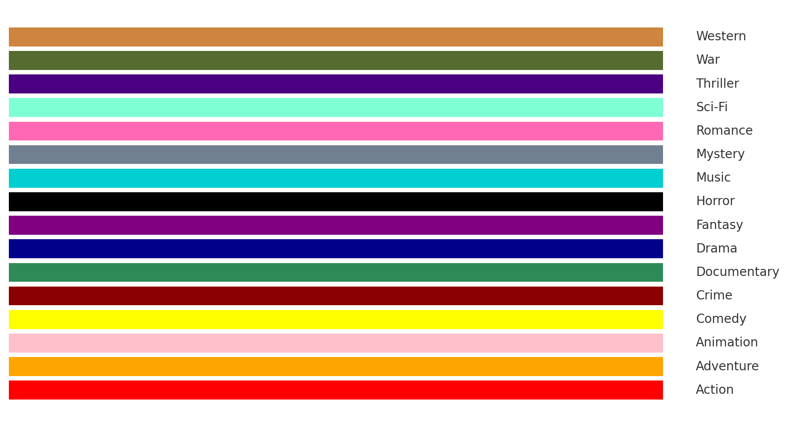

# Discord-Media-Bot
Wayne's 2-hour attempt at a Discord script to interact with channels talking about Movies and TV streaming, to let folks know when I'm watching something.

## Usage

When everything is setup and running properly, and the user invoking the command is currently in a Voice Channel (so they can stream), users can type:
`!watching Hereditary` and the script will include information about the movie, and a link to the Voice Channel you're currently in, to let people know they can watch with you.

The script also works for Youtube videos (maybe some more stuff later, idk), so you can also type:
`!watching https://www.youtube.com/watch?v=DNVuhP8ehdo` and the bot will respond with an embed, and a link to your current Voice Channel.

## Installation

### Prerequisites

1. [Node.js](https://nodejs.org/en/download) downloaded and installed.
2. An [OMDb API](https://www.omdbapi.com/apikey.aspx) key (Free tier should be fine for most usage). 
3. A [Discord App](https://discord.com/developers/applications) capable of adequate permissions.

### Setup (Discord App)

1. Create a [Discord App](https://discord.com/developers/applications) for your Media Bot
2. Save (or Reset) the **Token** and save that for later (DISCORD_BOT_TOKEN)
3. Under the **Bot** section, locate under **Privileged Gateway Intents** and enable these:
 - Presence Intent
 - Server Members Intent
 - Message Content Intent
4. Under the **OAuth2** section, locate the **Client ID** and save that for later (DISCORD_CLIENT_ID)

### Setup (Script)

1. Clone this Repository _somewhere_.
2. Jump into that _somewhere_ directory.
3. Run `npm install`
4. Create a new file called `.env`
5. Open `.env` in your favorite editor, and fill out these values:
```
DISCORD_BOT_TOKEN=<DISCORD_BOT_TOKEN>
DISCORD_CLIENT_ID=<DISCORD_CLIENT_ID>
DISCORD_CHANNEL_ID=<DISCORD_CHANNEL_ID>
OMDB_API_KEY=<OMDB_API_KEY>
```
| Key Name | Value Meaning | Source |
|---|---|---|
| DISCORD_BOT_TOKEN | The Bot Token from your Discord App, used to act as an authenticated 'user'.| **Discord Developer Dashboard** -> _(Your Application)_ -> **Bot** -> **Token** |
| DISCORD_CLIENT_ID | The Client ID of your Discord App, really only used to create a link at the end of the first run of the script. | **Discord Developer Dashboard** -> _(Your Application)_ -> **OAuth2** -> **Client ID** |
| DISCORD_CHANNEL_ID | The numeric Channel ID of the Discord Channel that you want the bot to listen for commands in. | To enable Developer Mode: **Discord** -> **User Settings (⚙️ icon)** -> **Advanced** (under **App Settings**) -> Toggle **Developer Mode**. To find the Channel ID: Right-click on the Channel that you'd like the bot to listen to, and select **Copy Channel ID** |
| OMDB_API_KEY | The API key used to lookup Movie and TV Show titles when using the `!watching` command. | [OMDB Website](https://www.omdbapi.com/apikey.aspx), you can select the Free tier to get started, but consider supporting them! |
6. Run either `node .` or `node run` and wait for a successful login.

### Uninteresting Notes

Discord Message Colors: Embed colors will change based on the genre of Movie/TV being linked, or by platform (Youtube links are Red). Here's a vibe-coded chart of what colors represent what, if you're curious:
